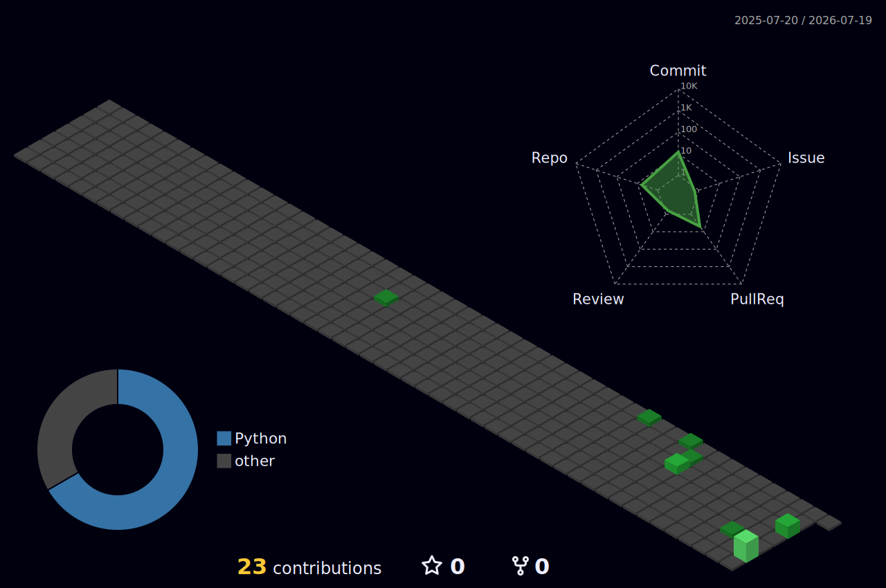

<div align="center">

<!-- ANIMATED HEADER -->


<!-- ANIMATED TYPING -->
<a href="https://github.com/suleymansd">
  
</a>

<br>

<!-- BADGES -->
<a href="https://github.com/suleymansd"></a>
<a href="https://github.com/suleymansd?tab=followers"></a>

<br><br>

<!-- SOCIAL LINKS -->
<a href="mailto:doguncu13@gmail.com"></a>
<a href="https://www.linkedin.com/in/YOUR-LINKEDIN"></a>
<a href="https://suleymandoguncu.com.tr"></a>
<a href="tel:+905452196863"></a>

</div>

<!-- ANIMATED LINE -->


##  &nbsp;Hakkımda

```yaml
ad: "Süleyman Döğüncü"
unvan: Software Engineer
sirket: CEO & Founder @ SvontAi
konum: Istanbul / Ankara, Turkiye
web: suleymandoguncu.com.tr
email: doguncu13@gmail.com

uzmanlıklar:
  saas_platformlari: "Tasarım → Geliştirme → Test → Canlıya Alma"
  mobil_uygulamalar: "iOS & Android (React Native)"
  web_uygulamalar: "Full-Stack Web Sistemleri"
  ai_sistemleri: "AI Agent, LLM Entegrasyonu, Federated Learning"
  devops: "CI/CD, Docker, AWS, Vercel Deployment"
  proje_yonetimi: "Teknik Liderlik, Sprint Planlama, Ekip Yönetimi"

aktif_platformlar:
  - { url: "quvexai.com", rol: "Full-Stack & Mimari" }
  - { url: "kyrai.com",   rol: "Geliştirme & Deployment" }

felsefe: "Fikirden ürüne, deploy sürecine kadar uçtan uca yönetiyorum."
```


## 🎯 Şu An Üzerinde Çalışıyorum

<div align="center">

```diff
+ 🚀 SvontAi — AI destekli SaaS platformu geliştiriyorum
+ 🧠 Federated Learning araştırmalarıma devam ediyorum
+ 📱 Mobil uygulama projeleri üzerinde çalışıyorum
+ 🌐 quvexai.com & kyrai.com platformlarını yönetiyorum
! 📖 Yeni teknolojiler öğrenmeye devam ediyorum
```

</div>


## ⚡ Hızlı Bilgiler

<div align="center">

| | |
|:---|:---|
| 🔭 Şu an **SvontAi** & **QuvexAI** üzerinde çalışıyorum | 🌱 **AI Agent mimarileri** ve **Federated Learning** öğreniyorum |
| 👨‍💻 Tüm projelerime [github.com/suleymansd](https://github.com/suleymansd) üzerinden ulaşabilirsiniz | 💬 **Next.js, Supabase, AI, SaaS** hakkında bana soru sorabilirsiniz |
| 📫 Bana ulaşın: **doguncu13@gmail.com** | 🏢 **CEO & Founder** @ SvontAi |
| ⚡ Fun fact: **Kod yazarken kahve yerine çay tercih ederim** 🍵 | 🎯 Hedef: **Türkiye'nin en iyi AI SaaS platformunu kurmak** |

</div>


## 🔬 Öne Çıkan Araştırma Projesi

<div align="center">

### 🧬 Cilt Kanseri Tespiti — Federated Learning

Merkezi olmayan (decentralized) veri yapısı üzerinde **Federated Learning** yaklaşımıyla  
cilt kanseri tespiti gerçekleştiren derin öğrenme projesi.  
Hasta verileri kurumlar arası paylaşılmadan, gizlilik korunarak model eğitimi sağlanmaktadır.


<br><br>

<a href="https://github.com/suleymansd/bitirmeprojesi">
  
</a>

</div>


## 💼 Ticari Projeler

> ⚠️ Bu projeler ticari/özel (private) niteliktedir. Teknik detaylar hakkında bilgi verebilirim.

<div align="center">

### 🛍️ AGENTIX — AI Agent SaaS Platformu

Türkiye pazar yerleri (Trendyol, Hepsiburada) satıcıları için çok ajanlı AI sistemi.

**ProductWriter** → Ürün açıklaması üretimi &nbsp;·&nbsp; **CustomerReply** → Müşteri yanıt otomasyonu &nbsp;·&nbsp; **OrderStatus** → Sipariş takibi


---

### 🛡️ RoastMyAPI — AI Destekli API Güvenlik Analizi

API uçlarını tarayıp güvenlik zafiyetlerini AI ile analiz eden, kredi bazlı micro-SaaS.


<br>

<a href="https://github.com/suleymansd/RoastApi">
  
</a>

</div>


## 🚀 Canlıda Çalışan Projeler

<div align="center">

<a href="https://svontai.vercel.app">
  
</a>
&nbsp;&nbsp;
<a href="https://system-web-next.vercel.app">
  
</a>
&nbsp;&nbsp;
<a href="https://quvexai.com">
  
</a>
&nbsp;&nbsp;
<a href="https://kyrai.com">
  
</a>

<br><br>


</div>


## 🌐 Aktif Görev Aldığım Platformlar

<div align="center">

| Platform | Açıklama | Rolüm |
|:---:|:---|:---|
| [](https://quvexai.com) | Psikolojik değerlendirme platformu. Davranışsal test altyapısı, dark-glass tasarım sistemi. | **Full-Stack & Platform Mimarisi** |
| [](https://kyrai.com) | AI teknolojileri ile güçlendirilmiş, kullanıcı odaklı akıllı platform. | **Geliştirme & Deployment** |

</div>


## 🌟 Açık Kaynak

<div align="center">

<a href="https://github.com/suleymansd/ilan">
  
</a>
&nbsp;&nbsp;
<a href="https://github.com/suleymansd/RoastApi">
  
</a>
&nbsp;&nbsp;
<a href="https://github.com/suleymansd/bitirmeprojesi">
  
</a>

</div>


## 🛠️ Teknoloji Yığını

<div align="center">


<br>

<br>


</div>


## 🏅 Yetkinlik Seviyeleri

<div align="center">

```text
Next.js / React       ████████████████████░░░░   85%
TypeScript / JS       ████████████████████░░░░   80%
Python / AI-ML        ███████████████░░░░░░░░░   65%
Supabase / PostgreSQL ████████████████████░░░░   80%
React Native / Mobile ██████████████░░░░░░░░░░   60%
DevOps / CI-CD        ███████████████░░░░░░░░░   65%
Proje Yönetimi        ████████████████████████   95%
UI/UX Design          ███████████████████░░░░░   75%
```

</div>


## 📊 GitHub İstatistikleri

<div align="center">
  
</div>

<br>

<div align="center">
  
</div>

<br>

<div align="center">
  
</div>


## 🧊 3D Katkı Grafiği

<div align="center">
  
</div>


## 🐍 Katkı Yılanı

<div align="center">
  <picture>
    <source media="(prefers-color-scheme: dark)" srcset="https://raw.githubusercontent.com/suleymansd/suleymansd/output/github-contribution-grid-snake-dark.svg">
    <source media="(prefers-color-scheme: light)" srcset="https://raw.githubusercontent.com/suleymansd/suleymansd/output/github-contribution-grid-snake.svg">
    
  </picture>
</div>


## 💡 Rastgele Geliştirici Alıntısı

<div align="center">
  
</div>


<div align="center">

### 📫 İletişim

**CEO & Founder** · SvontAi · İstanbul / Ankara  
İş birlikleri ve teknik danışmanlık için bana ulaşabilirsiniz.

<br>

<a href="mailto:doguncu13@gmail.com"></a>
<a href="tel:+905452196863"></a>
<a href="https://suleymandoguncu.com.tr"></a>
<a href="https://www.linkedin.com/in/YOUR-LINKEDIN"></a>

<br><br>


</div>
